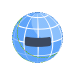

<!--Banner-->

<!--Night Owl image-->

  

    
<!--Header Name-->

  <picture  align="left">
    <source media="(prefers-color-scheme: dark)" srcset="./Robot Says Hi.gif">
    <source media="(prefers-color-scheme: light)" srcset="./Robot Says Hi.gif">
    
  </picture>

  ## ɪ'ᴍ ᴍᴏʜᴀᴍᴇᴅ ʏᴀssɪɴ!
  *Senior Fullstack Developer*

<!--Start Intro-->                         

I am a Senior Fullstack Developer with 5+ years of experience architecting and building scalable, high-performance web and mobile applications using React, Next.js, React Native, Node.js, and Express.

- ✨ Student of life :)
- 🌱 I’m currently learning many things, believing that everyday is a learning opportunity.
- 🚀 Specialized in modern ecosystems, leading engineering teams, and building robust RESTful APIs.
- 💻 Visit my [Portfolio](https://mohamedyassin.dev) for more details about my work.
<!--End Intro-->

<!--Profile Count Badge-->

  

---

<!--Languages and Tools Section--> 

  <picture>
    <source media="(prefers-color-scheme: dark)" srcset="./Skills_Animation_Dark.gif">
    <source media="(prefers-color-scheme: light)" srcset="./Skills_Animation_White.gif">
    
  </picture>

  

    
  

<h3 align="left">Key Projects</h3>
<ul align="left">
  <li><strong>Rouqy:</strong> A multi-vendor jewelry e-commerce platform and mobile app featuring interactive auctions, integrated online academies, and detailed vendor dashboards.</li>
  <li><strong>Edu Station:</strong> A comprehensive digital platform specialized in guiding students and securing international university admissions, providing seamless academic consultation.</li>
  <li><strong>Gefco (Al-Tamayouz Al-Zahaby):</strong> A corporate digital platform and showcase system for a leading manufacturing and contracting company specializing in architectural glass and structural facades in Saudi Arabia.</li>
</ul>
 
 

<!--Trophies Section-->    
<h2 align="center">🏆 Gɪᴛʜᴜʙ Tʀᴏᴘʜɪᴇs 🏆</h2>

  <a href="https://github.com/yas8295">
    <picture>
      <source media="(prefers-color-scheme: dark)" srcset="https://github-profile-trophy-ruddy.vercel.app/?username=yas8295&no-bg=true&row=2&column=6&margin-w=20&margin-h=20&theme=monokai">
      <source media="(prefers-color-scheme: light)" srcset="https://github-profile-trophy-ruddy.vercel.app/?username=yas8295&no-bg=true&row=2&column=6&margin-w=20&margin-h=20">
      
    </picture>
  </a>

 

<!--Github stats Table--> 
<h2 align="center">📊 Gɪᴛʜᴜʙ Sᴛᴀᴛs 📊</h2>

<table width="100%">
  <tr>
    <td width="50%">
      <h3 align="center"><strong>Gɪᴛʜᴜʙ Sᴛᴀᴛs</strong></h3>
      

        
      

    </td>
    <td width="50%">
      <h3 align="center"><strong>Sᴛʀᴇᴀᴋ Sᴛᴀᴛs</strong></h3>
      

        
      

    </td>
  </tr>
</table>
 

<!--Contribution Graph-->
<h2 align="center">📈 Cᴏɴᴛʀɪʙᴜᴛɪᴏɴ Gʀᴀᴘʜ 📈</h2>

    

 
<h3 align="center">🤝 Let's Connect</h3>

  <a href="https://wa.me/201280739906" target="_blank">
    <picture>
      <source media="(prefers-color-scheme: dark)" srcset="./whatsapp loop.gif">
      <source media="(prefers-color-scheme: light)" srcset="./whatsapp loop.gif">
      
    </picture>
  </a>
  &nbsp;&nbsp;
  <a href="https://mohamed-yassin.vercel.app/" target="_blank">
    <picture>
      <source media="(prefers-color-scheme: dark)" srcset="./Globe.gif">
      <source media="(prefers-color-scheme: light)" srcset="./Globe.gif">
      
    </picture>
  </a>
  &nbsp;&nbsp;
  <a href="mailto:mohamedyas8295@gmail.com" target="_blank">
    <picture>
      <source media="(prefers-color-scheme: dark)" srcset="./Gmail.gif">
      <source media="(prefers-color-scheme: light)" srcset="./Gmail.gif">
      
    </picture>
  </a>

 

